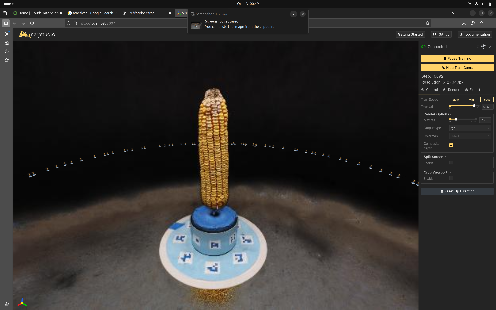

# 3D Reconstruction from Video using Nerfstudio

A complete pipeline for 3D reconstruction from monocular video using Neural Radiance Fields (NeRF) with Nerfstudio's nerfacto method.

## 📋 Table of Contents

- [Overview](#overview)
- [Prerequisites](#prerequisites)
- [Installation](#installation)
- [Pipeline Workflow](#pipeline-workflow)
- [Results](#results)
- [Challenges & Solutions](#challenges--solutions)
- [Project Structure](#project-structure)
- [References](#references)

## 🎯 Overview

This project demonstrates a complete 3D reconstruction pipeline that:
- Extracts frames from video input
- Estimates camera poses using COLMAP
- Trains a Neural Radiance Field using nerfacto
- Exports a high-quality 3D point cloud

**Key Technologies:** Nerfstudio, COLMAP, NeRF, Open3D, Weights & Biases

## 📦 Prerequisites

- Python 3.8+
- CUDA-capable GPU (recommended)
- COLMAP installed
- FFmpeg for video processing

## 🚀 Installation

### 1. Install Nerfstudio

```bash
pip install nerfstudio
```

For detailed installation instructions, visit [Nerfstudio Documentation](https://docs.nerf.studio/quickstart/installation.html)

### 2. Install Additional Dependencies

```bash
pip install open3d wandb
```

### 3. Login to Weights & Biases

```bash
wandb login
```

## 🔄 Pipeline Workflow

### Task 1: Video Processing

Extract frames and estimate camera poses from your video:

```bash
ns-process-data video \
  --data YOUR_VIDEO.mp4 \
  --output-dir YOUR_OUTPUT_DIR \
  --num-frames-target 120
```

**Parameters:**
- `--data`: Path to input video file
- `--output-dir`: Directory for processed data
- `--num-frames-target`: Number of frames to extract (120 recommended)

**Output:** Extracted frames + COLMAP camera pose estimates

---

### Task 2: Camera Pose Visualization

Visualize the estimated camera trajectory:

```bash
python camera_pose_display.py --input_dir YOUR_OUTPUT_DIR
```

**Generates:**
- Perspective view of camera poses
- Top-down view of camera trajectory

These visualizations help assess the quality of pose estimation before training.

---

### Task 3: NeRF Training with Nerfacto

Train the Neural Radiance Field model:

```bash
ns-train nerfacto \
  --viewer.quit-on-train-completion True \
  --pipeline.model.predict-normals True \
  --vis "viewer+wandb" \
  --data YOUR_OUTPUT_DIR \
  --output-dir YOUR_TRAIN_OUTPUT_DIR
```

**Key Parameters:**
- `--viewer.quit-on-train-completion`: Auto-close viewer after training
- `--pipeline.model.predict-normals`: Enable normal prediction for better geometry
- `--vis "viewer+wandb"`: Enable both viewer and W&B logging

**Training Process:**
1. Opens viewer at `http://localhost:7007`
2. Trains for ~30k iterations (default)
3. Logs metrics to Weights & Biases
4. Saves model checkpoints

---

### Task 4: Bounding Box Cropping (Optional)

While training, optimize the export region:

1. Open viewer: `http://localhost:7007`
2. Click **Crop** tool in the viewer
3. Adjust bounding box around object of interest
4. Note the OBB parameters for export

---

### Task 5: Point Cloud Export

Export the trained NeRF as a point cloud:

```bash
ns-export pointcloud \
  --load-config /PATH/TO/YOUR/config.yml \
  --output-dir /PATH/TO/YOUR/exports \
  --num-points 1000000 \
  --remove-outliers True \
  --normal-method open3d \
  --save-world-frame False \
  --obb_center 0.0 0.0 0.0 \
  --obb_rotation 0.0 0.0 0.0 \
  --obb_scale 1.0 1.0 1.0
```

**Parameters:**
- `--num-points`: Number of points (1M recommended)
- `--remove-outliers`: Clean noisy points
- `--normal-method`: Use Open3D for normal estimation
- `--obb_*`: Bounding box parameters from viewer

**Output:** High-quality `.ply` point cloud file

## 📊 Results

### Camera Pose Estimation

| Perspective View | Top View |
|:----------------:|:--------:|
|  |  |

**Assessment:** The camera poses show smooth trajectory with good coverage of the scene. 

### NeRF Reconstruction



**Training Metrics:**
- Training Time: 15 minutes
- Final PSNR: XX.XX dB
- GPU: [Your GPU Model]

**Quality Assessment:** The reconstruction captures [describe quality - fine details, geometry accuracy, texture fidelity, etc.]

### Point Cloud Export


**Specifications:**
- Points: 1,000,000
- Format: PLY with normals
- File Size: 27.5 MB

[Download Point Cloud](exports/point_cloud.ply)

## 🔧 Challenges & Solutions

### Challenge 1: [Camera Pose Estimation Quality]

**Issue:** During the preprocessing stage, COLMAP was unable to properly match image features and estimate accurate camera poses. Out of the extracted frames, only 2 images were successfully matched, meaning COLMAP found poses for only about 1% of the dataset. This resulted in poor initialization for NeRF training and extremely slow convergence (7–8 hours with only 2 valid frames).Also not able to create point Cloud out of it.

**Solution:** I found that downgrading COLMAP from version 3.11 to 3.8 resolved the pose estimation problem completely as COLMAP 3.8 works better because it uses an older, more stable and compatible matching system that matches consecutive frames more effectively and produces output Nerfstudio can easily read. Finally the reconstruction was successful and camera poses were estimated correctly.

---

### Challenge 2: [Training Time/GPU Memory]

**Issue:** Training was very slow and frequently ran out of GPU memory when using RTX 3050 (4 GB) and RTX 3060 (6 GB) GPUs. I also tried running the training on Google Colab, where it initially worked but was limited by Colab’s restricted GPU availability and session timeouts. Eventually, the GPU memory on Colab was also exhausted, causing the training process to stop midway.

**Solution:** To overcome this, I switched to a system equipped with an RTX 4080 Super (16 GB) GPU. With this higher memory capacity and faster processing power, the training ran smoothly without interruptions and achieved 100% GPU utilization throughout the process.

---

### Challenge 3: [Point Cloud Quality]

**Issue:** Initially, COLMAP was able to match only 2 images successfully from the extracted frames. After training for 7–8 hours using just these 2 valid frames, the model failed to generate a meaningful point cloud, resulting in an incomplete reconstruction.

**Solution:** After downgrading COLMAP to a more stable version and improving feature matching, all frames were successfully aligned. I then set the target frame count (--num-frames-target) to 70 and 120, which provided enough image diversity for training. With these changes, the model successfully generated a high-quality point cloud of around 1,000,000 points in each run.

### Challenge 4: [Installation Problem]

**Issue:** colmap_to_json() TypeError.

**Solution:** Removed deprecated argument camera_model="OPENCV" from the function call.

**Issue:** tiny-cuda was not installing properly.

**Solution:** No solution. Ran without tiny-cuda. Some sort compatability issue.

---

### General Observations

- **Setup Complexity:** Nerfstudio installation was straightforward but required CUDA toolkit setup
- **COLMAP Dependency:** Pose estimation quality heavily depends on video quality and camera movement
- **Training Duration:** Approximately 15 minutes on [GPU model]
- **Memory Usage:** Peak GPU memory: 13 GB

## 📁 Project Structure

```
├── README.md
├── camera_pose_display.py      # Pose visualization script
├── data/
│   └── YOUR_VIDEO.mp4          # Input video
├── processed_data/             # Processed frames & poses (Task 1)
│   ├── images/
│   ├── colmap/
│   └── transforms.json
├── outputs/                    # Training outputs (Task 3)
│   ├── nerfacto/
│   │   ├── config.yml
│   │   └── nerfstudio_models/
│   ├── pose_perspective.png    # Pose visualizations (Task 2)
│   └── pose_top.png
├── exports/                    # Point cloud exports (Task 5)
│   └── export.ply
└── report.md                   # Detailed findings
```

## 🎓 Reflections

### What Worked Well
- [Add your observations about what went smoothly]
- The nerfacto pipeline produced high-quality results
- Pose estimation was robust with proper video input

### Areas for Improvement
- [Add suggestions for future improvements]
- Could experiment with different NeRF variants (instant-ngp, etc.)
- Fine-tuning bounding box parameters could improve point cloud quality

### Key Learnings
- [Your key takeaways from the assignment]
- Understanding the importance of camera pose quality for NeRF training
- Trade-offs between point cloud density and file size

## 📚 References

- [Nerfstudio Documentation](https://docs.nerf.studio/)
- [NeRF: Representing Scenes as Neural Radiance Fields](https://www.matthewtancik.com/nerf)
- [Instant Neural Graphics Primitives](https://nvlabs.github.io/instant-ngp/)
- [COLMAP Structure-from-Motion](https://colmap.github.io/)

---

## 🔗 Quick Links

- [Weights & Biases Dashboard](https://wandb.ai/chatterjeeakash887-prom-iit-rajasthan/nerfstudio-project/runs/uhesvnre?nw=nwuserchatterjeeakash887)

