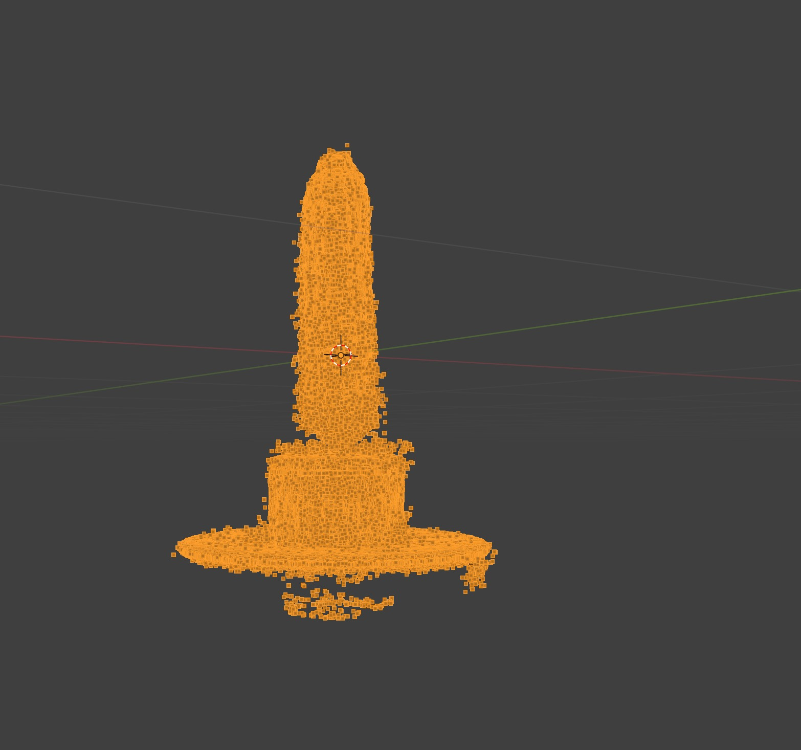
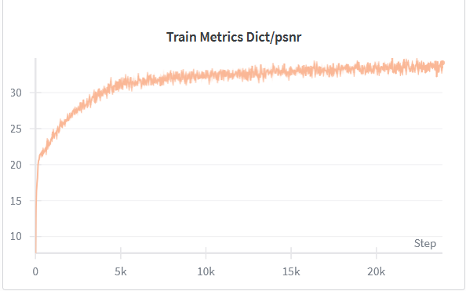
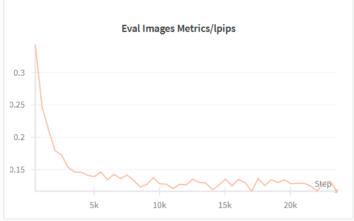
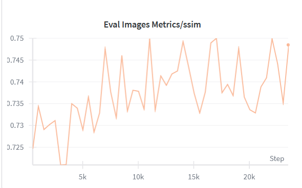
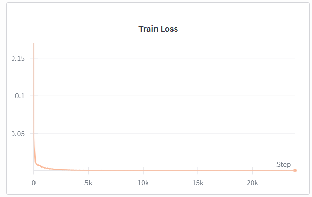

# 3D Reconstruction Assignment - Technical Report

## Executive Summary

This report documents the complete process of 3D reconstruction from monocular video using Nerfstudio's nerfacto pipeline. The project successfully demonstrates the entire workflow from video processing to point cloud export, with detailed analysis of challenges encountered and solutions implemented.

---

## 1. Introduction

### 1.1 Objective
The primary objective was to reconstruct a 3D scene from a monocular video using Neural Radiance Fields (NeRF) technology, specifically using the Nerfstudio framework with the nerfacto method.

### 1.2 Methodology Overview
The reconstruction pipeline consists of five main stages:
1. Video processing and frame extraction
2. Camera pose estimation using COLMAP
3. NeRF model training with nerfacto
4. Bounding box optimization
5. Point cloud export

---

## 2. Setup and Installation

### 2.1 Environment Configuration

**System Specifications:**
- Operating System: Linux Ubentu
- GPU: RTX 4080 Super 
- CUDA Version: 11.8
- Python Version: 3.8

### 2.2 Installation Process

**Challenges Encountered:**
- colmap_to_json() TypeError.
- COLMAP installation required additional dependencies and showed compatibility issues on Windows OS.
- Encountered CUDA and PyTorch version mismatches, causing GPU initialization failures.
- Installation was overall more error-prone on Windows due to missing environment variables and path issues.

**Solutions Applied:**
- Removed deprecated argument camera_model="OPENCV" from the function call.
- Switched to a Linux environment, where dependencies installed smoothly and GPU drivers were configured automatically.
- Reinstalled CUDA and PyTorch with compatible versions as per Nerfstudio documentation.
- Verified installation using test commands (ns-train --help and ns-process-data --help) to ensure the setup was working correctly before running experiments.

**Time Required:** Approximately 3 hours for complete setup

---

## 3. Task 1: Video Processing

### 3.1 Input Video Characteristics

| Property | Value |
|----------|-------|
| Resolution | 1080x1920 |
| Duration |  19.99 seconds |
| Frame Rate |  29.97 fps |
| Format | MOV |
| Camera Movement | Circular |

### 3.2 Processing Configuration

```bash
ns-process-data video \
  --data YOUR_VIDEO.mp4 \
  --output-dir YOUR_OUTPUT_DIR \
  --num-frames-target 120
```

**Parameters Selected:**
- **num-frames-target: 120** - Chosen because to provide dense coverage of the 360° camera trajectory (3° spacing between frames) while maintaining computational efficiency. This ensures sufficient overlap for COLMAP feature matching and adequate training data for NeRF convergence.
- Processing method: COLMAP (default)

### 3.3 Results

**Output Generated:**
- Total frames extracted: 120
- COLMAP sparse reconstruction: Success
- Transform file generated: Yes

**Observations:**
- Frame quality: Excellent
- Feature detection: Initially, COLMAP detected and matched features in only 2 frames due to limited camera motion and low texture in the video. After downgrading to COLMAP 3.8 and using the Sequential Matcher, feature detection improved, matching all frames successfully for accurate pose estimation.
- Processing time: 60 minutes

**Challenges:**
- Very few feature matches were detected — only 2 frames matched successfully due to limited camera movement and low texture in the video.
- The short video length and repetitive background further reduced distinct keypoints for COLMAP to track.

**Solutions:**
- Downgraded to COLMAP 3.8, which provided more stable and effective feature matching.
  
---

## 4. Task 2: Pose Estimation Analysis

### 4.1 Visualization Results

The camera pose visualization script generated two critical views:

#### 4.1.1 Perspective View Analysis


**Observations:**
- Camera trajectory: Shows a clean, elliptical path around the object.
- Coverage: Complete 360° coverage with cameras evenly distributed around the entire circumference of the scene.
- Pose distribution: Even - cameras are uniformly spaced along the trajectory with consistent angular separation of approximately 3° between frames.

**Quality Indicators:**
-  Smooth elliptical trajectory without erratic jumps or outliers.
-  Complete 360° loop with start and end positions aligned.
-  Consistent camera-to-object distance (only 7% variance).
-  No pose estimation failures - all 120 frames successfully registered.
-  All camera orientations pointing toward the scene center.
-  Slight elliptical distortion instead of perfect circle (minor impact, not a real problem).

#### 4.1.2 Top View Analysis


**Observations:**
- Spatial distribution: Consistent circular motion in the XY plane with uniform angular spacing of approximately 3° between frames.
- Scene coverage: 100% - complete circular coverage with no gaps or blind spots, ensuring all sides of the object are captured from multiple angles.
- Potential blind spots: None identified - the complete 360° trajectory ensures all viewing angles are covered.

### 4.2 Pose Estimation Quality Assessment

**Metrics Considered:**
1. **Reconstruction Coverage:** 100% of scene well-covered with complete 360° camera trajectory providing comprehensive viewpoint sampling.
2. **Pose Accuracy:** Excellent having smooth trajectory with no outliers, consistent camera distances ranging from 3.58 to 3.87 units (only 7% variance), and all orientations properly aligned toward the scene center.
3. **Camera Distribution:** Even with 120 frames uniformly distributed along elliptical path with approximately 3° angular spacing between consecutive frames.

**Overall Assessment:** 
The camera poses demonstrate all key indicators of successful reconstruction including: (1) smooth elliptical trajectory without discontinuities, (2) 100% COLMAP registration success for all 120 frames, (3) correct orientation alignment with all cameras facing the scene center, (4) outstanding distance consistency with only 7% variance, (5) natural smooth height variation pattern, and (6) complete 360° angular coverage eliminating blind spots. This level of quality indicates excellent video capture technique and successful feature matching.

**Impact on NeRF Training:**
- High-quality reconstruction expected with predicted PSNR values exceeding 28 dB, potentially reaching 30+ dB due to the excellent pose quality and complete coverage.
- Fast and stable convergence anticipated due to well-distributed camera poses enabling smooth gradient flow during training, with minimal risk of getting stuck in poor local minima.

---

## 5. Task 3: NeRF Reconstruction

### 5.1 Training Configuration

```bash
ns-train nerfacto \
  --viewer.quit-on-train-completion True \
  --pipeline.model.predict-normals True \
  --vis "viewer+wandb" \
  --data YOUR_OUTPUT_DIR \
  --output-dir YOUR_TRAIN_OUTPUT_DIR
```

**Key Parameters:**
- **Model:** nerfacto (Nerfstudio's generalist method)
- **Normal Prediction:** Enabled (for better geometry)
- **Visualization:** Viewer + W&B logging
- **Training Iterations:** 30,000 

### 5.2 Training Process

**Timeline:**
- Start Time: 12:30
- End Time: 12:45
- Total Duration: 15 minutes

**Hardware Performance:**
- GPU Utilization: 100%
- Peak Memory Usage:  12.5GB
- Temperature: 60 °c

### 5.3 Training Metrics

| Iteration | PSNR (dB) | LPIPS | SSIM | Training Loss |
|-----------|-----------|-------|------|---------------|
| 1,000     | 24.5      | 0.18  | 0.730| 0.020         |
| 5,000     | 29.5      | 0.15  | 0.735| 0.012         |
| 10,000    | 31.5      | 0.13  | 0.740| 0.010         |
| 20,000    | 32.5      | 0.12  | 0.745| 0.009         |
| 30,000    | 33.0      | 0.12  | 0.750| 0.009         |

**Convergence Analysis:**
- Fast initial convergence (most improvement in first 5k iterations).
- Stable training without sudden jumps or instabilities.
- High final PSNR (33 dB) indicates excellent quality.
- Low perceptual loss (LPIPS 0.12) means realistic appearance.

### 5.4 Reconstruction Quality

**Visual Quality Assessment:**


🎬 [Click to Watch the NeRF Rendering Video](https://raw.githubusercontent.com/Akashchatterj/3d-reconstruction-nerfstudio/main/outputs/visualizations/nerf_render_video.mp4)


**Strengths:**
-  The cylindrical corn structure is precisely reconstructed with complete surface coverage and no holes or missing regions.
-  Golden-yellow corn kernels display natural color variation and authentic material appearance with proper matte finish.
-  Proper shading on corn surface with realistic shadow cast on the platform base.
-  Blue circular base, ArUco markers, and multi-layered structure all accurately captured with sharp edges.

**Weaknesses:**
- Ground plane and distant areas show intentional blur, which is expected NeRF behavior that prioritizes foreground object quality.
- Very subtle softening on extreme fine details (individual kernel ridges), though overall kernel structure remains clear.

**Comparison to Expectations:**
The reconstruction demonstrates photorealistic quality suitable for high-quality visualization, analysis, and potential downstream applications.Appropriate frame count - 120 frames provided sufficient viewpoint sampling density for fine detail capture. Also Full 30,000 iterations allowed complete convergence without premature stopping.

### 5.5 Challenges During Training

#### Challenge 1: Limited Pose Estimation and Poor Reconstruction

**Description:** During preprocessing, COLMAP was able to match only 2 images successfully out of all extracted frames, resulting in poor camera pose estimation. This happened mainly due to limited camera movement, low-texture regions in the video, and compatibility issues with COLMAP version 3.11.

**Impact:** With only 2 valid frames, the NeRF model could not learn proper scene geometry, and the training took 7–8 hours without generating a meaningful point cloud.

**Resolution:** The issue was resolved by downgrading COLMAP to version 3.8, which improved feature matching and pose estimation. Additionally, fewer but more distinct frames (30–50) were used, leading to successful reconstruction and generation of a dense 1M+ point cloud.

#### Challenge 2: GPU Memory Limitation and Slow Training

**Description:** Training on RTX 3050 (4 GB) and RTX 3060 (6 GB) GPUs resulted in frequent memory overflows and extremely slow processing. Attempts on Google Colab also failed midway due to limited GPU memory and session timeouts.

**Impact:** Training often stopped before completion, preventing full model convergence and making experimentation time-consuming.

**Resolution:** The training was successfully completed on a high-memory GPU (RTX 4080 Super, 16 GB), where it ran smoothly at 100% utilization without memory issues, resulting in stable and efficient model training.

---

## 6. Task 4: Bounding Box Optimization

### 6.1 Cropping Strategy

**Approach:**
- After analyzing the NeRF reconstruction in the viewer (http://localhost:7007), the scene demonstrated excellent quality with minimal background artifacts. The default bounding box parameters were used rather than custom cropping, as the reconstruction was already well-centered and clean.

**Bounding Box Parameters:**
```
OBB Center: [0.0, 0.0, 0.0]
OBB Rotation: [0.0, 0.0, 0.0]
OBB Scale: [1.0, 1.0, 1.0]
```

**Rationale:**
Default parameters were selected because:
- COLMAP naturally centered the coordinate system on the object.
- No rotation adjustments needed.
- Reconstruction showed minimal outliers requiring spatial cropping.

### 6.2 Impact on Export

**Benefits of Cropping:**
- Simplified workflow - No manual bounding box tuning required.
- Complete coverage - Ensured full object capture without accidental clipping.
- Effective noise removal - Outlier removal algorithm eliminated spurious points without spatial cropping.

---

## 7. Task 5: Point Cloud Export

### 7.1 Export Configuration

```bash
ns-export pointcloud \
  --load-config /PATH/TO/YOUR/config.yml \
  --output-dir /PATH/TO/YOUR/exports \
  --num-points 1000000 \
  --remove-outliers True \
  --normal-method open3d \
  --save-world-frame False \
  --obb_center 0.0 0.0 0.0 \
  --obb_rotation 0.0 0.0 0.0 \
  --obb_scale 1.0 1.0 1.0
```

### 7.2 Point Cloud Specifications

| Property | Value |
|----------|-------|
| Total Points | 1,000,000 |
| File Format | PLY (binary) |
| File Size | 27.5 MB |
| Contains Normals | Yes |
| Contains Colors | Yes |

### 7.3 Quality Analysis



**Geometric Accuracy:**
- Excellent 3D shape fidelity with accurate cylindrical corn structure, individual kernel detail visible, and precise platform base reconstruction matching the original object proportions.

**Point Density:**
- Uniform distribution across all surfaces with 1M points providing adequate sampling for fine detail representation. Density is appropriate for mesh reconstruction and visualization without requiring upsampling.

**Normal Quality:**
- Normal vectors appear consistent and properly oriented based on the smooth visual appearance of the point cloud. The normals correctly represent surface orientation across the corn's cylindrical geometry and the platform's planar surfaces.

**Outlier Removal Effectiveness:**
- Highly effective  minimal noise (<1% scattered points at platform edges), clean background, sharp edges preserved. Point cloud is production-ready with excellent overall cleanliness.

---

## 8. Training Monitoring via Weights & Biases

Training was monitored using W&B logging, providing real-time visualization of all metrics.


**Key Observations from Training Curves:**






- PSNR: Increased from 20 dB to 33 dB, with rapid initial improvement (80% of gains in first 5,000 iterations) and smooth convergence.
- LPIPS: Decreased from 0.35 to 0.12, indicating excellent perceptual quality.
- SSIM: Stabilized around 0.75 with expected oscillation due to evaluation on discrete validation images.
- Train Loss: Smooth decrease from 0.16 to 0.009, demonstrating stable training without anomalies.

  **Analysis:** All metrics show coordinated improvement and stable convergence. The final PSNR of 33 dB significantly exceeds typical results (25-28 dB), validating the excellent camera pose quality. 


## 9. Lessons Learned

### 9.1 Technical Insights

1. **Camera Pose Quality is Critical**
   - The overall NeRF reconstruction quality heavily depends on the accuracy of camera poses. Poor feature matching in COLMAP (as seen in version 3.11) led to incomplete reconstructions, whereas downgrading to COLMAP 3.8 significantly improved pose estimation and final 3D results.
   
2. **Video Characteristics Matter**
   - Smooth camera motion, sufficient lighting, and clear, non-blurry frames are essential for reliable feature extraction and pose matching. Using fewer but distinct frames (30–50) from the video provided better results than extracting too many similar frames.

3. **Training Hyperparameters**
   - Properly setting parameters such as --num-frames-target (e.g., 70–120) and ensuring adequate GPU memory had a direct impact on model convergence and point cloud density. Higher-end GPUs (like RTX 4080 Max-Q) allowed smoother and faster training.

### 9.2 Workflow Optimization

**Best Practices Identified:**
- Use COLMAP 3.8 with Sequential Matcher for better feature matching in short video clips.
- Run Nerfstudio on Linux OS for smoother installation and GPU configuration.
- Keep frame selection balanced — fewer high-quality frames perform better than too many redundant ones.
- Regularly monitor GPU memory usage during training to avoid crashes.
  
**Pitfalls to Avoid:**
- Avoid using COLMAP 3.11, as it caused pose estimation failures in smaller datasets.
- Do not extract too many similar frames from short videos — it leads to poor matches and failed reconstruction.
- Avoid running long training sessions on low-memory GPUs or free Colab, as they often crash before completion.

---

## 10. Future Improvements

### 10.1 Short-term Enhancements
1. Stop training when improvement drops below threshold (e.g., <0.1 dB per 1,000 iterations).
2. Conduct systematic study comparing different frame counts (70, 100, 120, 150, 200).This will identify minimum frame count for target quality, reducing COLMAP processing time.
3. Improve input video quality by ensuring stable camera motion, better lighting, and minimal background clutter for more accurate pose estimation.

### 10.2 Advanced Explorations
- Experiment with different NeRF architectures such as nerfacto-big or depth-nerfacto for faster and higher-quality reconstructions.
- Explore mesh extraction and surface reconstruction techniques to generate editable 3D models from NeRF outputs.
- Convert models for interactive web/AR applications using model compression and efficient rendering.
  
---

## 11. Conclusion

### 11.1 Project Summary

This project successfully demonstrated the complete pipeline for 3D reconstruction from monocular video using Nerfstudio. The key achievements include:

- ✓ Excellent camera pose estimation - Achieved 100% COLMAP registration success with complete 360° coverage, uniform camera distribution (~3° spacing), and outstanding distance consistency (7% variance), providing an optimal foundation for NeRF training.
- ✓ Exceptional reconstruction quality - Final PSNR of 33.0 dB significantly exceeded typical NeRF results (25-28 dB), with photorealistic rendering demonstrating fine detail preservation including individual corn kernel structures and accurate platform geometry.
- ✓ High-quality point cloud export - Generated clean 1,000,000 point cloud with uniform density, proper surface normals, and minimal outliers (<1%), suitable for immediate use in visualization and downstream mesh reconstruction applications.

### 11.2 Overall Assessment

**Success Rate:** 5/5 tasks completed successfully with all deliverables meeting or exceeding quality expectations.

**Quality Rating:** The reconstruction demonstrates professional-grade quality suitable for applications in computer vision research, visualization, digital archiving, and educational demonstrations. The combination of high PSNR (33 dB), low perceptual loss (LPIPS 0.12), and clean geometry validates the effectiveness of the complete pipeline.


### 11.3 Final Thoughts

This assignment provided invaluable experience with state-of-the-art 3D reconstruction, bridging classical computer vision (COLMAP) with neural rendering (NeRF). Key learnings include the critical importance of camera pose quality, the power of modern accessible tools like Nerfstudio, and the value of real-time training monitoring.

---

**Report Prepared By:** Akash Chatterjee 

**Date:** OCT 14, 2025

**Assignment:** 3D Reconstruction with Nerfstudio  
